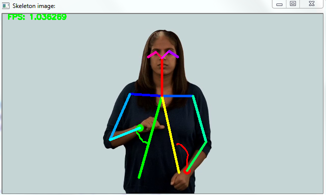
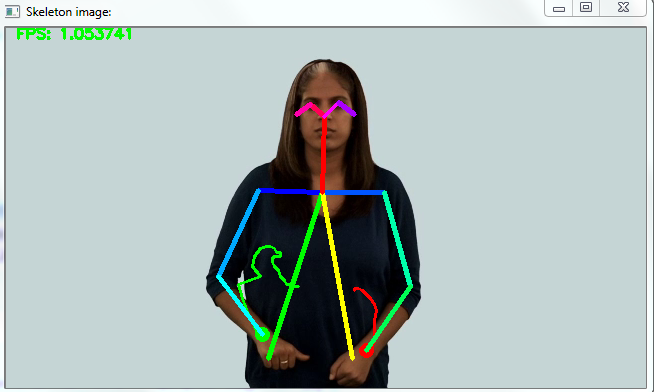
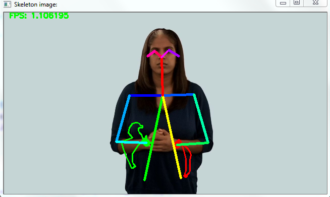

# Hand Movement Trajectories Tracking (Based on OpenPose Skeleton)
## Methodology


## Results
<div align="center">
  <a href="https://youtu.be/dDDbRsdWtpk?t=6"></a>
</div>
<p align="center">

</p>  
<p align="center">

</p>


## Version Notes
For the reference, this model has been developed and tested in the the CPU desktop of  8 GB RAM 3.00 GHz Intel Core i5-4590SCPU  processor, also on a GPU desktop with two NVIDIA GeForce GTX 1080Ti adapter cards and 3.3 GHz In-tel Core i9-7900X CPU with 16 GB RAM. 

**for CPU environment the model was implemeted in:**
- Tensorflow 1.11
- python 3.6.5
- OpenCV 3.3.1   

**for GPU environment the model was implemeted in**
- Ten-sorflow 1.12
- Python 3.6.8
- OpenCV 3.4.2 

## Citations
```
@inproceedings{liang2019handtracking,
  author = {X. Liang, E. Kapetanios, B. Woll and A. Angelopoulou},
  booktitle = {Cross Domain Conference for Machine
Learning and Knowledge Extraction (CD-MAKE2019)},
  title = {Real Time Hand Movement Trajectory Tracking for Enhancing
Dementia Screening in Ageing Deaf Signers of British Sign Language},
  year = {2019}
}
```
